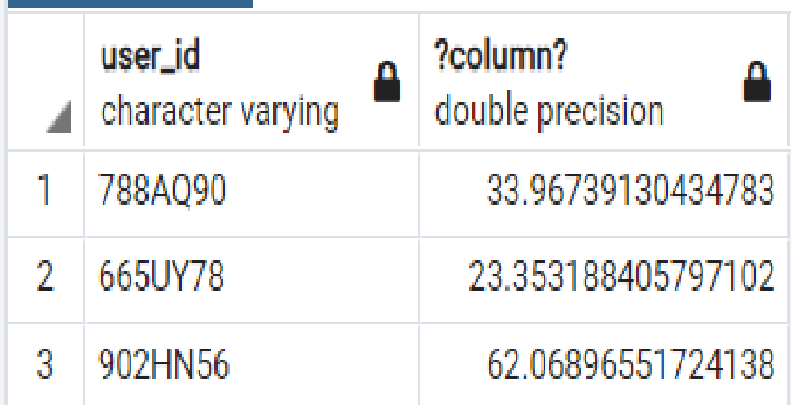

# Till_Business_Analyst_Homework_Assignment

### Exercise : 1

### 1. Provide the SQL code that generates the rent-to-income ratios for every user as of the latest date both income and rent data are available.
### 2. What analysis would you run (without actually coding it up!) to understand the impacts of income against ability to pay rent? Feel free to provide thorough explanation and your thought process.

--create income_data table
CREATE TABLE income_data (
    user_id VARCHAR,
    date DATE,
    amount FLOAT
);

--create rent_data table
CREATE TABLE rent_data (
    user_id VARCHAR,
    date DATE,
    charge_type VARCHAR,
    amount FLOAT,
    paid FLOAT
);

--Rename the columns 
ALTER TABLE income_data
RENAME COLUMN amount TO income_amount;

ALTER TABLE rent_data
RENAME COLUMN amount TO rent_amount;
              
--create new table incomerent by joining two tables 
CREATE TABLE incomerent AS(
SELECT inc.user_id,
    inc.income_amount,
    re.rent_amount
FROM income_data AS inc
    INNER JOIN rent_data AS re
    ON (inc.user_id = re.user_id));

--calculate the rent to income ratio.
SELECT user_id , (SUM (rent_amount)/ SUM(income_amount))*100

### 3. Situation: You meet with Karen, our VP of Product, David, our CEO, and Joey, our Head of Data & Analytics, to review your analysis. It's clear that income and the ability to pay rent are correlated, and we want to provide more insight to our landlord partners than a univariate correlation. 
    
    You're sent on a discovery project to find what else might be interesting. Write 1-2 paragraphs explaining the question(s) you would ask yourself and/or stakeholders to dig deeper, the approach you would take to discovery, and what data you would test first (assuming it's all at your disposal)?
    
I would ask more questions around following topics;

What is the minimum income should a tenant have? 
What’s the average rent you are charging a tenant? 
What are some other factors besides rent you might want to consider once you find their income? 
What’s the approximate rate increase every year at lease renewal?
    
### Exercise : 2

### Using R, Python, or another statistical package, perform a regression on this data to model MSRP (price) as a function of other inputs from the data, and then answer these questions. Please share your code and full analysis. 

### Though not a requirement, consider using R Markdown or Jupyter Notebook, to annotate your work. Another option would be to thoroughly comment in-file.

### 1. What does your model tell you about hybrid vehicle pricing? What insights can you draw?
### 2. Did you use a standard linear regression model or a different type, and if so, why?
### 3. Which variables did you choose to include and exclude from your model and why? Did you define any of your own explanatory variables from the data?
### 4. Which variables have significant explanatory power on hybrid vehicle pricing? Which do not? Is this surprising?
### 5. How confident are you in your model's fit? Why?

We have a dataset that contains nine columns: carid, vehicle, year, msrp, accelerate, mpg, mpgmpge, carclass, carclass_id. msrp could be a good variable to start with because higher numbers are expected to go higher. Though there are other factors like mpg or mpgmpge as well. But we will think about them later. We will fit the model where msrp will be expressed as a function of the weight. we have a coefficient of 9.5.
Let’s add a second variable and see how it affects the regression performance. I choose mpg and mpgmpge. In this new model, mpg is expressed as the function of both mpg and mpgmpge. The coefficient of weight is -2.49 which is very lower than before.

we will visualize the result of the regression model. We will plot the regression line that is the fitted values or the predicted values with the confidence interval. 

we show a scatter of msrp versus accelerate. We get the impression that there is no straight line so it is not a good fit but if we show a scatter of mpg versus mpgmpge. We get the impression that a straight line provides a reasonably good fit.
